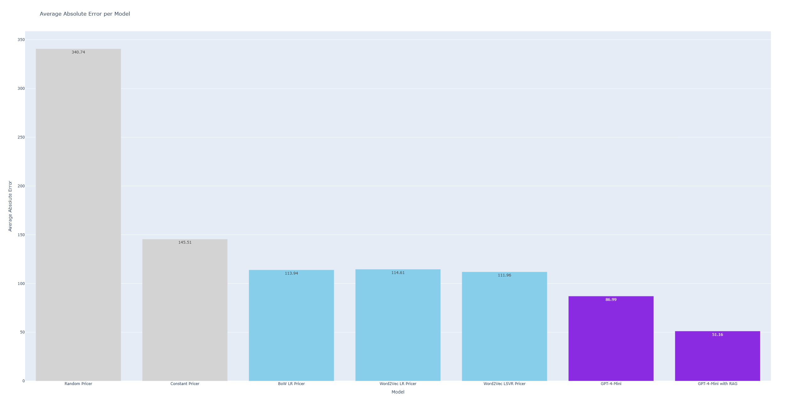

# LLM Regression

Can we actually do regression tasks with LLMs? And are they any good? Let's see...

I do 2 main projects:

- GPT-4 mini with RAG
- Train Llama 3.1 with QLoRA 🕐 *(Coming soon)*

## Benchmark models

1. Random prices
2. Average price of training set
3. Bag of Words + Linear Regression
4. Word2Vec + Linear Regression
5. Word2Vec + Linear SVR
6. GPT-4 mini
7. **GPT-4 mini with RAG**
8. Quantized Llama 3.1
9. **Finedtuned Llama 3.1** 🕐 *(Coming soon)*



## Quickstart

1. Install conda
2. Create and install the environment with Python 3.11:

   ```bash
   conda env create -f environment.yml -n llm-regression python=3.11
   conda activate llm-regression
   ```

3. Create the `.env` file and add your token keys

    ```env
    OPENAI_API_KEY=sk-proj-...
    HF_TOKEN=hf_...
    WANDB_API_KEY=... (Optional)
    ```

4. Run the benchmark `python -m llm_regressor.benchmark`

### RAG regression

Uses RAG on gpt-4 mini model.

Before using RAG, you must create Chroma DB `python -m llm_regressor.rag_regressor.create_db`


### Training Llama

Normally you DON'T need to train, you will download my trained model directly from Hugging Face, but if you wish to train follow this steps:

- Request access to the [Llama 3.1 model on Hugging Face](https://huggingface.co/meta-llama/Llama-3.1-8B):
    1. Visit the [Llama 3.1 8B model page](https://huggingface.co/meta-llama/Llama-3.1-8B)
    2. Click "Request access to this model"
    3. Fill out the access request form with your intended use case
    4. Wait for Meta's approval (usually takes 1-2 business days)
    5. Once approved, your HF_TOKEN will have access to download the model
- Select Training parameters (Optional): Change parameters like epochs, batch size, QLoRA hyper-parameters in [llm_regressor/__init__.py](https://github.com/NEGU93/llm_regression/blob/main/llm_regressor/__init__.py).
- Then run `python -m llm_regressor.trainer`

### The dataset

The dataset is a curated version of . 
It is currently stored [here](https://huggingface.co/datasets/NEGU93/pricer-data) and it will be automatically downloaded with thanks to your HF_TOKEN.